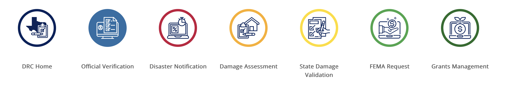
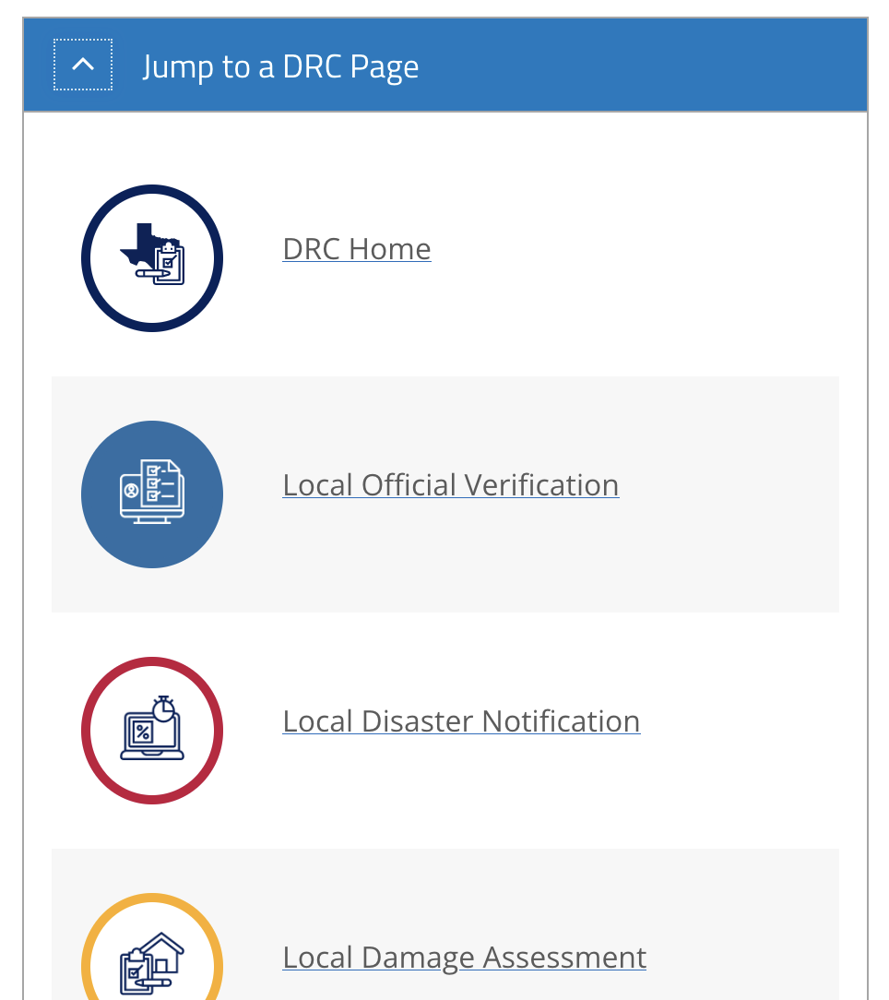
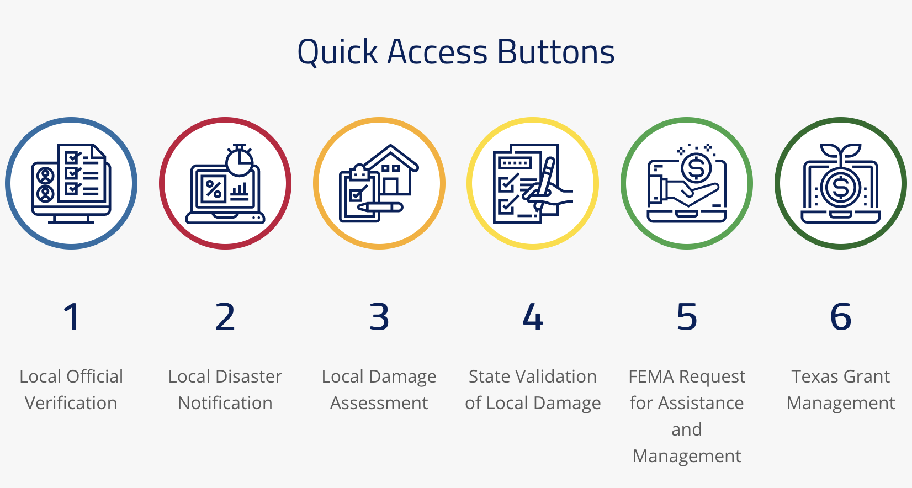
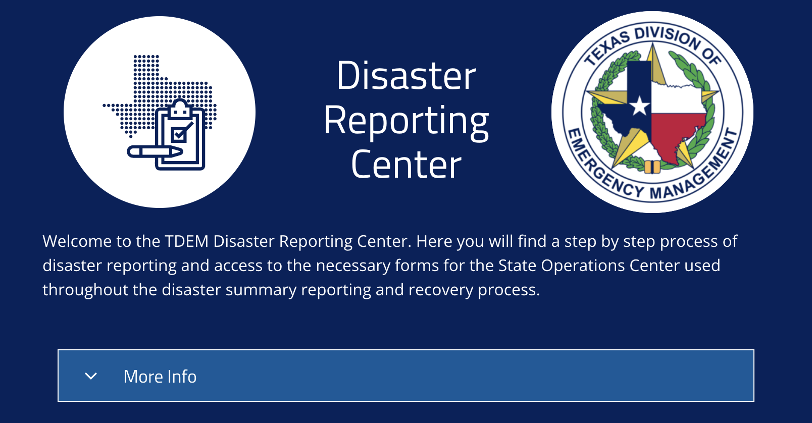
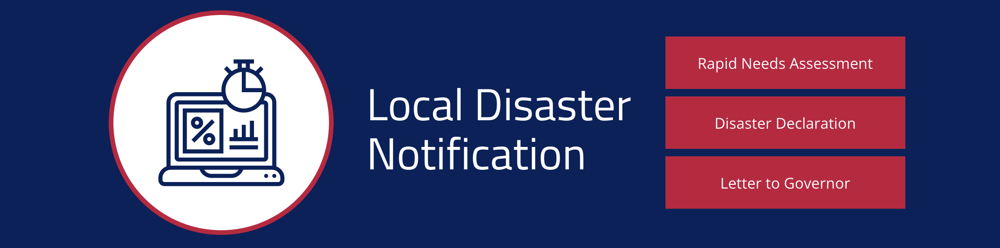
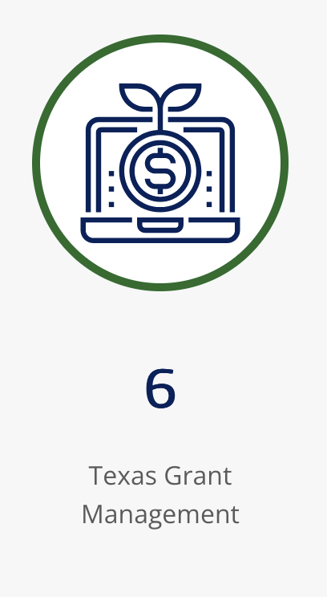
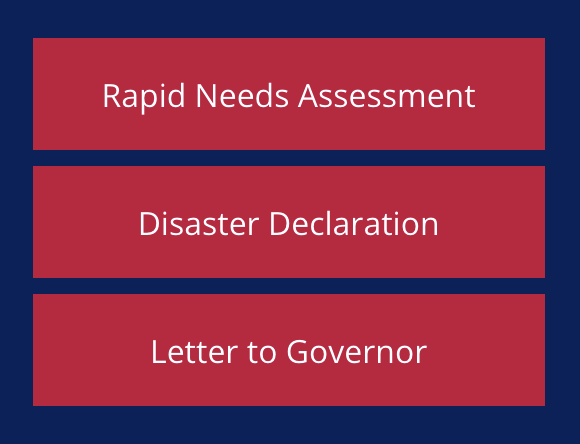

# tdem-hub-elements

This repo contains **custom code, SVG icons, and style guidelines** for the Disaster Reporting Center hub site, https://disaster-reporting-center-tdem.hub.arcgis.com/. 

## Custom Code

Custom code for the site is stored in the "Final Hub Code" and "Templates" folders. 

### Final Hub Code

This contains samples of the final code used in the site, with formatting and links inserted. 

* `drc-header-nav.html` contains the source code for the navigation row at the top of DRC sub-pages. At medium screen sizes and smaller (992px as defined by Bootstrap,) the full-width code is no longer rendered, and a Bootstrap accordion with the responsive code inside replaces it. Within the Hub site, this code is stored in a text element inside a row. 

 

* `drc-homepage-nav.html` contains the source code for the navigation row used on the DRC homepage. At screen sizes of 768 px and smaller, the full-width code is replaced with the responsive code. Within the Hub site, this code is stored in a text element inside a row. 

* `drc-header-rows.html` contains the source code for all of the blue rows used to title pages, with large icons in circles, page titles, and buttons. This file contains examples of the homepage and the Local Disaster Notification page. Within the Hub site, this code is stored in a text element inside a row element with the background set to `--dark-blue` (as defined in `Templates/colors.css`.)

  

* **`everything.css`** compiles all of the CSS used for custom elements into a convenient file, which has been included in the HTML of each header row in the DRC. **Note: this code contains styling for all of the text displayed on the page.** **Additional note: this file references the font Titillium Web, which is currently used in titles.**

### Templates 

This contains template code for all DRC custom elements, ready to be filled in with specific links, colors, and icons.

* `colors.css` includes custom variables for each color used in the DRC branding.
* `typography.css` styles different heading levels, buttons, and links. **Note: this file references the font Titillium Web, which is currently used in titles.**
* `circle-icon` contains examples for all styles of icons framed in circles on the site. 

* `elements` contains examples of all small combinations of elements used in larger rows. 

 

* `groups` contains examples of all responsive rows featuring multiple elements, including navs and header rows. 
## SVGs

Each of these files contains the HTML code to create a specific SVG icon. To include these:
* Go to the page for any icon and click the "Raw" button
* Copy that link!

The files ending in "-small" should be used in the header nav, whereas the others should be used in header rows and the homepage nav.

 

**Attribution: icons created by Eucalyp from Noun Project, https://thenounproject.com/eucalyp/.**

